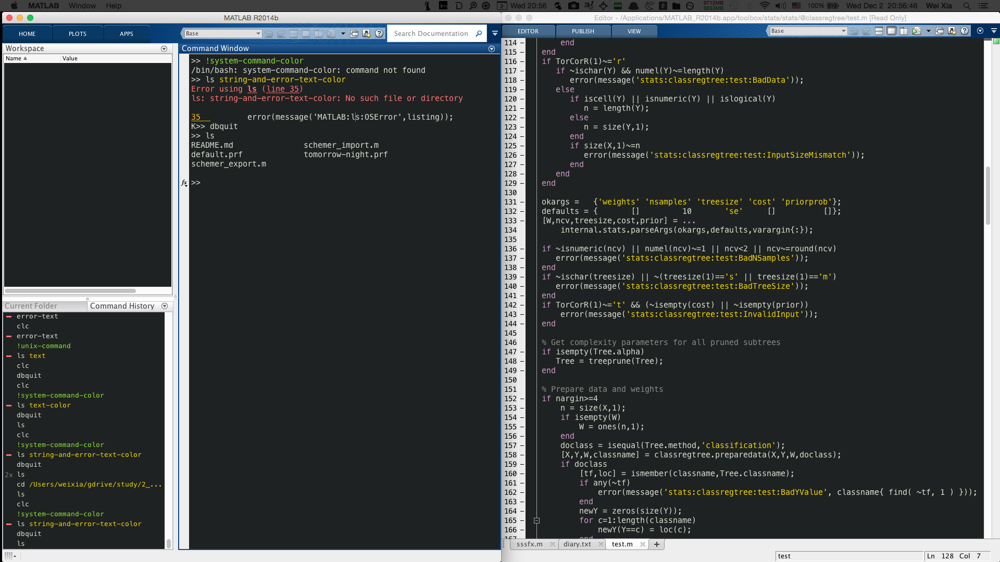

# Tomorrow Night Color Scheme for Matlab
This color scheme setting lets you use Tomorrow Night color scheme with Matlab.

## Usage
* Back up your current color scheme 
               
      schemer_export('current.prf')
    
* Import the tomorrow-night color scheme
      
      schemer_import('tomorrow-night.prf')
    
* Revert to the Matlab default color scheme
      
      scheme_import('default.prf')

## Credits
This color scheme uses the [Base16 Theme](https://github.com/chriskempson/base16) (formerly the [Tomorrow Theme]()) and [Matlab-schemer](https://github.com/scottclowe/matlab-schemer).